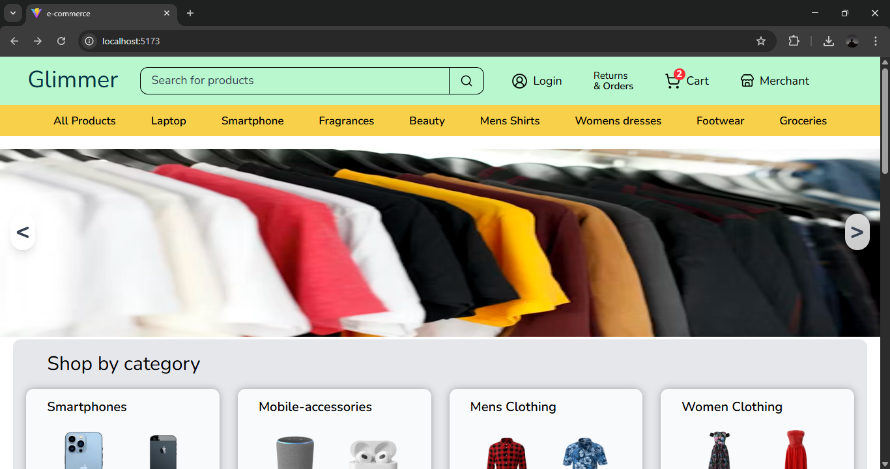
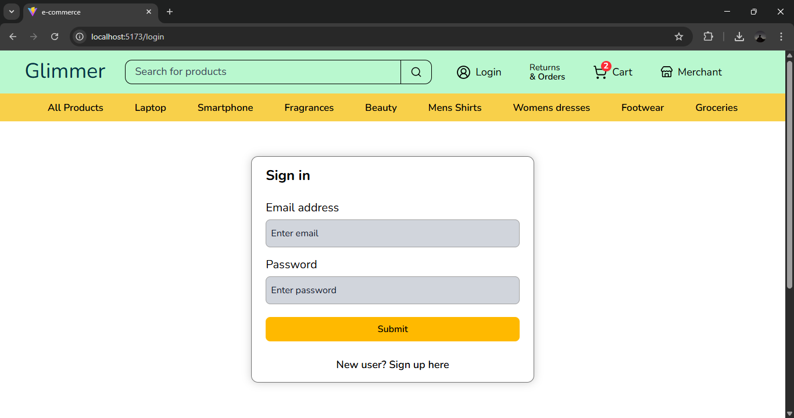
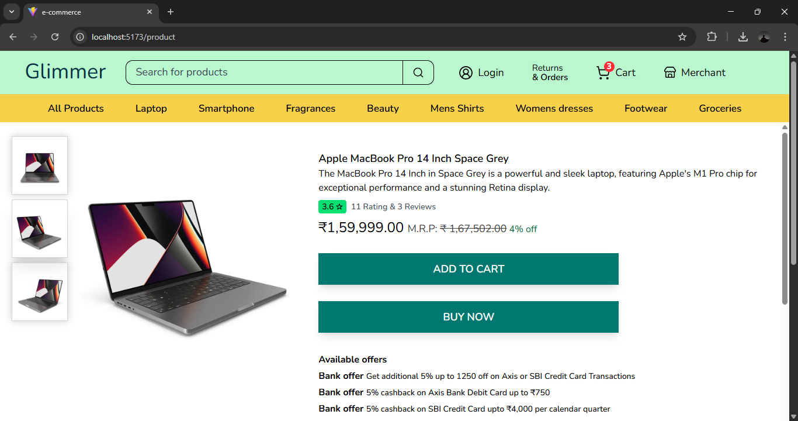
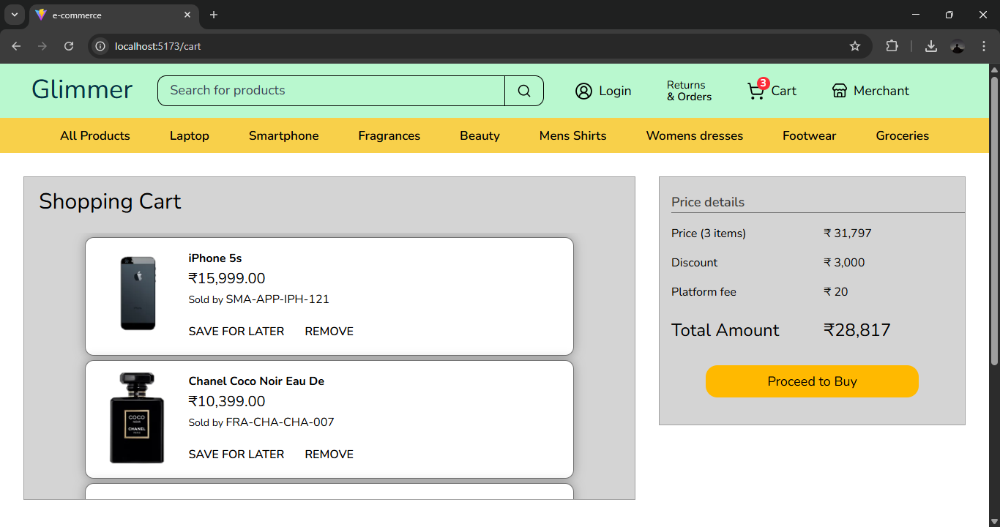
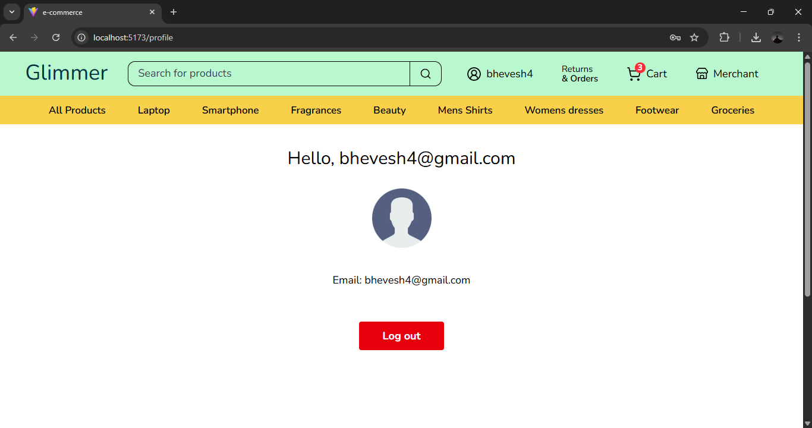

# 🛍️ Glimmer – E-Commerce Web Application

**Glimmer** is a modern e-commerce web application focused on providing a smooth shopping experience with authentication, product browsing, and cart functionality. The project is currently under development, with scalability and feature enhancements planned.

---

## 🚀 Features

### ✅ Implemented
- 🔐 User authentication using **Firebase**
- 🛒 Cart management using **React Context API**
- 📦 Product listing and product detail pages
- 🔄 Global state management with Context API
- ⚡ Fast and interactive UI with React

### 🚧 Upcoming
- 📱 Make the application fully **responsive**
- 🧠 Migrate state management to **Redux Toolkit**
- 💳 Integrate **Razorpay** for online payments
- 📦 Order history and checkout flow

---

## 🛠️ Tech Stack

| Technology | Purpose |
|----------|---------|
| React | Component-based UI |
| JavaScript (ES6+) | Application logic |
| Context API | State management |
| Firebase | Authentication |
| Tailwind CSS | Styling |

---

## 🔐 Authentication

Firebase Authentication is used for:
- User signup  
- User login  

---

## 📸 Screenshots

---

## 🌐 Live Demo

https://glimmer-e-commerce.vercel.app/

---

